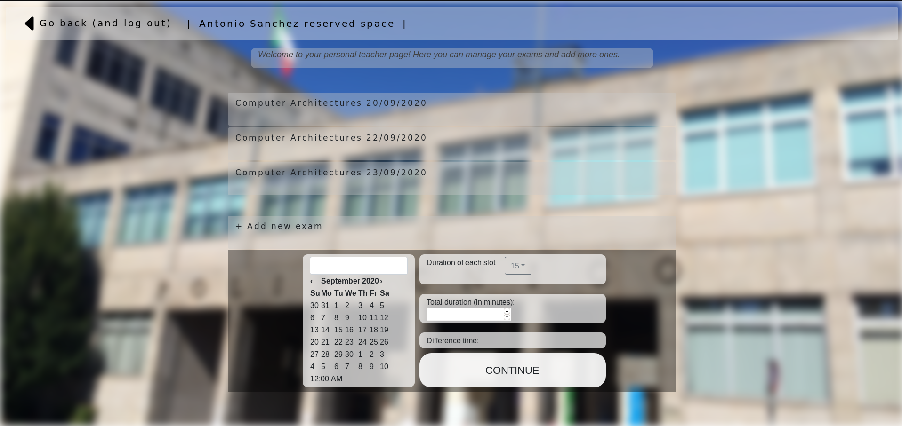

##Usage
in the project folder:
`cd client & npm install & npm start`
`cd server & npm install & npm start`

## React client application routes

- Route `/`: redirect to 'home'
- Route `/home`: home page, where the user can choose between two different kind of accesses: 'student' and 'teacher'. Teacher access requires login. 
- Route `/student`: student page. Based on his student id, the user can book one of the available slots or manage his reservations.
- Route `/teacher`: teacher page. The teacher can add grades (or mark as absent) the students that have booked some slot, or he can add more exams defining the students, the date, the duration of one slot and the total duration.

## REST API server

- POST `/api/login`
 - request.body.name and request.body.password
 - response (in case of success) with id and name of the teacher
- POST `/api/logout`
 - clear the ongoing session
- POST `/api/availableSlot`
 - request.body.course
 - list of slots for that exam
- POST `/api/getExam`
 - request.body.stuid (id of the student)
 - exams of the student
- POST `/api/registerBooking`
 - request.body.stuid (id of the student) and request.body.exam (name of the exam) and request.body.start_date
 - err or ok
- POST `/api/getBookedSlot`
 - request.body.student_id and request-body.exam
 - slot booked by the student
- DELETE `/api/deleteBooking/:stuid`
 - request.body.exam
 - err or ok
  
  __login required__
  
 - GET `/api/getExams`
  - request.user.teacher (teacher name)
  - list of teacher exams
 - GET `/api/teacher`
  - request.user.teacher (teacher name)
  - ok if the teacher is logged in
 - POST `/api/studentLine`
  - request.body.exam
  - information about students in the exam
 - POST `/api/lineInfo`
  - request.body.exam and request.body.student
  - information about already booked slot
 - POST `/api/setGrade`
  - request.body.grade and request.body.student and request.body.exam
  - add grade (or absent as -1) for a booking
 - POST `/api/addExam`
  - request.body.date and request.body.students (list of selected students) and request.body.duration (of a single slot) and request.body.duration_total (total duration)
  - err or ok
 - GET `/api/getStudents`
  - request.user.teacher (teacher name)
  - list of students of an exam
 

## Server database

- Table `Courses` - contains Name Teacher id | (list of courses)
- Table `Exams` - contains Name Teacher id course_id | (list of exams linked to teacher and course)
- Table `Students` - contains id exams course_id | (list of students linked to courses and exams)
- Table `Students_Courses` - contains Student Course Passed | (information about students linked to courses)
- One Table for each new exam with Start End Status Student Grade

## Main React Components

- `Home` (in `hoe.js`): home page

- `Student` (in `student.js`): student page
- `Navv` (in `navbar.js`): navbar. It's different if it's called from a student or from a teacher
- `Student` (in `student.js`): student page
- `Exam` (in `exam_student.js`): slots for an exam.
- `Booking` (in `booking.js`): for booking one slot.

- `TeacherPage` (in `teacherPage.js`): teacher page
- `Exam` (in `exam_teacher.js`): wrapper of the booked slots for an exam
- `StudentLine` (in `student_line.js`): component for adding grade or set as absent.

(only _main_ components, minor ones may be skipped)

## Screenshot

## Test users

### Teachers
* Antonio Sanchez, sanchez_sanchez
* Jaakko Lehtinen, leppavara
* Tuomas Aura, ciao95 (frequent customer)
* Fulvio Corno, terzoAppello
* Michela Grossi, 91x54gf (frequent customer)

## Students
* s265389
* s273459
* s274300
* s261249
* s265090
* s250013
* s261818
* s271248
* s260123
* s271890
* s261209
* s253090
* s272307
* s263102
